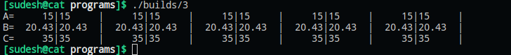
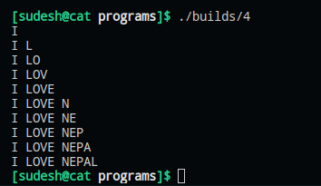

# To be familiar with unformatted and formatted I/O

### **WAP to get your name, address and display using unformatted I/O.**

#### **Code**
    #include <stdio.h>

    int main()
    {
        char name[30], address[30];
        puts("Enter your name: ");
        gets(name);
        puts("");
        puts("Enter your address: ");
        gets(address);
        puts("");
        puts("Name: ");
        puts(name);
        puts("Address: ");
        puts(address);
        return 0;
    }

#### **Output**
    Enter your name: 
    sudesh

    Enter your address: 
    dharan 13

    Name: 
    sudesh

    Address: 
    dharan 13

### **WAP to get a character form the user using unformatted I/O and display the ASCII value of the entered character.**

#### **Code**
    #include <stdio.h>

    int main()
    {
        char c;
        int ascii_value;
        puts("Enter a character: ");
        c = getchar();
        ascii_value = c;
        printf("The ascii value of %c is %d\n", c, ascii_value);
        return 0;
    }

#### **Output**
    Enter a character:
    A
    The ascii value of A is 65

### **WAP to display the output as [take a=15, b=20.43, c=35]**
    A=    15|15    |    15|15    |    15|15    |    15|15    |    15|15    |
    B= 20.43|20.43 | 20.43|20.43 | 20.43|20.43 | 20.43|20.43 | 20.43|20.43 |
    C=    35|35    |    35|35    |    35|35    |    35|35    |    35|35    |

#### **Code**
    #include <stdio.h>

    int main()
    {
        int A = 15, C = 35;
        float B = 20.43;
        printf("A=%7d|%-7d|%7d|%-7d|%7d|%-7d|%7d|%-7d|%7d|%-7d|\n", A, A, A, A, A, A, A, A, A, A);
        printf("B=%7.2f|%-7.2f|%7.2f|%-7.2f|%7.2f|%-7.2f|%7.2f|%-7.2f|%7.2f|%-7.2f|\n", B, B, B, B, B, B, B, B, B, B);
        printf("C=%7d|%-7d|%7d|%-7d|%7d|%-7d|%7d|%-7d|%7d|%-7d|\n", C, C, C, C, C, C, C, C, C, C);
        return 0;
    }

#### **Output**

### **WAP to display the output as below using formatted I/O [ take char a[]=”I LOVE NEPAL" ].**
    I
    I L
    I LO
    I LOV
    I LOVE
    I LOVE N
    I LOVE NE
    I LOVE NEP
    I LOVE NEPA
    I LOVE NEPAL

#### **Code**
    #include <stdio.h>

    int main()
    {
        char a[] = "I LOVE NEPAL";
        printf("%.1s\n", a);
        printf("%.3s\n", a);
        printf("%.4s\n", a);
        printf("%.5s\n", a);
        printf("%.6s\n", a);
        printf("%.8s\n", a);
        printf("%.9s\n", a);
        printf("%.10s\n", a);
        printf("%.11s\n", a);
        printf("%.12s\n", a);
        return 0;
    }

#### **Output**ma
