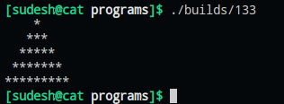

# To be familiar with LOOPS

### **WAP to read 10 numbers from users and finds the sum and average.**

#### **Code**
    #include <stdio.h>

    int main()
    {
        int sum = 0, num, i;
        float avg;
        printf("Enter 10 numbers: ");
        for(i=0; i<10; i++)
        {
            scanf("%d", &num);
            sum += num;
        }
        avg = sum / 10.0;
        printf("Sum = %d\n", sum);
        printf("Average = %.2f\n", avg);
        return 0;
    }

#### **Output**
    Enter 10 numbers: 1 2 3 4 5 6 7 8 9 10
    Sum = 55
    Average = 5.50

### **WAP to display the multiplication table of integer given by the user.**

### **Code**
    #include <stdio.h>

    int main()
    {
        int num, i;
        printf("Enter a number: ");
        scanf("%d", &num);
        printf("\nMULTIPLICATION TABLE OF %d\n", num);
        for(i=1; i<=10; i++)
        {
            printf("%3d * %-2d =  %d\n", num, i, num*i);
        }
        return 0;
    }

#### **Output**
    Enter a number: 9

    MULTIPLICATION TABLE OF 9
      9 * 1  =  9
      9 * 2  =  18
      9 * 3  =  27
      9 * 4  =  36
      9 * 5  =  45
      9 * 6  =  54
      9 * 7  =  63
      9 * 8  =  72
      9 * 9  =  81
      9 * 10 =  90

### **WAP to input two integer values from the user and print the even numbers between the**
### **range of integers. Also count the even number and display the count as well [Hint: if**
### **user enters 10 and 100. The program should print and count even numbers between 10 and 100].**

#### **Code**
    #include <stdio.h>

    int main()
    {
        int low, high, i, count=0;
        printf("Enter a range: ");
        scanf("%d%d", &low, &high);
        printf("The even numbers are: \n");
        for(i=low; i<=high; i++)
        {
            if(i % 2 == 0)
            {
                printf("%d\t", i);
                count++;
            }
        }
        printf("\nNo of even numbers between %d and %d: %d\n", low, high, count);
        return 0;
    }

#### **Output**
    Enter a range: 10 30
    The even numbers are: 
    10  12  14  16  18  20  22  24  26  28  30
    No of even numbers between 10 and 30: 11

### **WAP to display sum of series: 1 + 1/2 + 1/3 + 1/4 + 1/5 + ... 1/n**

#### **Code**
    #include <stdio.h>

    int main()
    {
        int n, i;
        double sum = 0.0;
        printf("Enter a number: ");
        scanf("%d", &n);
        for(i=1; i<=n; i++)
            sum += 1.0/i;
        printf("Reciprocal sum = %.3lf\n", sum);
        return 0;
    }

#### **Output**
    Enter a number: 10
    Reciprocal sum = 2.929

### **WAP to display sum of series: 1 + 1/2! + 1/3! + 1/4! + 1/5! + ... 1/n!**

#### **Code**
    #include <stdio.h>

    long factorial(int n)
    {
        if(n<2)
            return 1;
        return n * factorial(n-1);
    }

    int main()
    {
        int n, i;
        double sum=0.0;
        printf("Enter a number: ");
        scanf("%d", &n);
        for(i=1; i<=n; i++)
            sum += 1.0 / factorial(i);
        printf("1/1! + 1/2! + . . . . + 1/%d! = %lf\n", n, sum);
        return 0;
    }

#### **Output**
    Enter a number: 10
    1/1! + 1/2! + . . . . + 1/10! = 1.718282

### **WAP to display sum of series: x + x2/2! + x3/3! + x4/4! + x5/5! + ... xn/n!**

#### **Code**
    #include <stdio.h>
    #include <math.h>

    long factorial(int n)
    {
        if(n<2)
            return 1;
        return n * factorial(n-1);
    }

    int main()
    {
        int n, i, x;
        double sum=0.0;
        printf("Enter the value of x and n: ");
        scanf("%d%d", &x, &n);
        for(i=1; i<=n; i++)
            sum += pow(x, i) / factorial(i);
        printf("%d/1! + %d^2/2! + . . . . + %d^%d/%d! = %lf\n", x, x, x, n, n, sum);
        return 0;
    }

#### **Output**
    Enter the value of x and n: 2 10
    2/1! + 2^2/2! + . . . . + 2^10/10! = 6.388995

### **WAP to find the value cos(x) without using cos(x) library function.**

#### **Code**
    #include <stdio.h>
    #include <math.h>

    #define LIMIT 15

    long factorial(int);
    double deg_to_rad(double);
    double cosine(double);

    int main() {
        int i;
        double deg, rad, value;
        printf("Enter the value in degree: ");
        scanf("%lf", &deg);
        rad = deg_to_rad(deg);
        value = cosine(rad);
        printf("cos(%.2lf)  =  %.3lf\n", deg, value);
        return 0;
    }

    long factorial(int n) {
        long fact = 1;
        if(n < 0)
            return n;
        else if(n < 2)
            return 1;
        else
            while(n > 1) {
                fact *= n--;
            }
            return fact;
    }

    double deg_to_rad(double deg) {
        return M_PI * deg / 180.0;
    }

    double cosine(double rad) {
        int i, flag = 1;
        double sum = 0.0;

        for(i=0; i<LIMIT; i++) {
            sum += flag * pow(rad, 2*i) / factorial(2*i);
            flag *= -1;
        }
        return sum;
    }
#### **Output**
    Enter the value in degree: 30
    cos(30.00)  =  0.866

### **WAP to display whether a number is Armstrong or not**

#### **Code**
    #include <stdio.h>

    int main()
    {
        int n, sum=0, i, mod, og_num;
        printf("Enter a three digit number: ");
        scanf("%d", &n);
        og_num = n;
        for(i=0; i<3; i++)
        {
            mod = n % 10;
            n /= 10;
            sum += mod * mod * mod;
        }
        if(sum == og_num)
            printf("The number %d is an armstrong number.\n", og_num);
        else
            printf("The number %d is not a armstrong number.\n", og_num);
        return 0;
    }

#### **Output**
    Enter a three digit number: 153
    The number 153 is an armstrong number.

### **WAP to display the first n terms of Fibonacci series**

#### **Code**
    #include <stdio.h>

    int main()
    {
        int n, i, first = 0, second = 1, temp;
        printf("Enter a number: ");
        scanf("%d", &n);
        printf("The first %d fibonacci numbers are: \n", n);
        for(i=0; i<n; i++)
        {
            printf("%d  ", first);
            temp = second;
            second += first;
            first = temp;
        }
        printf("\n");
        return 0;
    }

#### **Output**
    Enter a number: 10
    The first 10 fibonacci numbers are: 
    0  1  1  2  3  5  8  13  21  34 

### **WAP to display the number in reverse order.**

#### **Code**
    #include <stdio.h>

    int main()
    {
        int n, mod, rev=0, count=0, copy;
        printf("Enter a number: ");
        scanf("%d", &n);
        copy = n;
        while(copy != 0)
        {
            count++;
            copy /= 10;
        }
        while(n != 0)
        {
            rev *= 10;
            mod = n % 10;
            rev += mod;
            n /= 10;
        }
        printf("Number in reverse: %0*d\n", count, rev);
        return 0;
    }

#### **Output**
    Enter a number: 12054300
    Number in reverse: 00345021

### **WAP to check whether a number is a palindrome or not**

#### **Code**
    #include <stdio.h>

    int main()
    {
        int n, mod, rev=0, copy;
        printf("Enter a number: ");
        scanf("%d", &n);
        copy = n;
        while(copy != 0)
        {
            rev *= 10;
            mod = copy % 10;
            rev += mod;
            copy /= 10;
        }
        if(n == rev)
            printf("%d is a palindrome.\n", n);
        else
            printf("%d is not a palindrome.\n", n);
        return 0;
    }

#### **Output**
    Enter a number: 13231
    13231 is a palindrome.

### **WAP to find HCF and LCM of two numbers.**

#### **Code**
    #include <stdio.h>

    int main()
    {
        int a, b, lcm, hcf;
        printf("Enter two number: ");
        scanf("%d%d", &a, &b);
        // hcf
        if(a < b)
            hcf = a;
        else
            hcf = b;
        while(hcf > 0)
        {
            if( a % hcf==0 && b % hcf == 0 )
                break;
            hcf--;
        }
        // lcm
        lcm = a * b / hcf;
        printf("The hcf of %d and %d is %d\n", a, b, hcf);
        printf("The lcm of %d and %d is %d\n", a, b, lcm);
        return 0;
    }

#### **Output**
    Enter two number: 12 44
    The hcf of 12 and 44 is 4
    The lcm of 12 and 44 is 132

### **WAP to print the following patterns: **
    1                 1 2 3 4 5                *           1
    1 2               1 2 3 4                 ***          2 3
    1 2 3             1 2 3                  *****         4 5 6
    1 2 3 4           1 2                   *******        7 8 9 10
    1 2 3 4 5         1                    *********       11 12 13 14 15

          1 2 3 4 5 4 3 2 1            5 4 3 2 1
            1 2 3 4 3 2 1              5 4 3 2
              1 2 3 2 1                5 4 3
                1 2 1                  5 4
                  1                    5

#### **Program 1**
    #include <stdio.h>

    int main()
    {
        int j, i;
        for(j=1; j<=5; j++)
        {
            for(i=1; i<=j; i++)
                printf("%d  ", i);
            printf("\n");
        }
        return 0;
    }

#### **Output**

#### **Program 2**
    #include <stdio.h>

    int main()
    {
        int j, i;
        for(j=1; j<=5; j++)
        {
            for(i=1; i<=6-j; i++)
                printf("%d  ", i);
            printf("\n");
        }
        return 0;
    }

#### **Output**

#### **Program 3**
    #include <stdio.h>

    int main()
    {
        int j, space, star;
        for(j=4; j>=0; j--)
        {
            // spaces
            for(space=0; space<j; space++)
                printf(" ");
            // star
            for(star=0; star<2*(5-j)-1; star++)
                printf("*");
            printf("\n");
        }
        return 0;
    }

#### **Output**

#### **Program 4**
    #include <stdio.h>

    int main()
    {
        int j, i, count=0;
        for(j=0; j<5; j++)
        {
            for(i=0; i<j+1; i++)
                printf("%d  ", ++count);
            printf("\n");
        }
        return 0;
    }

#### **Output**

#### **Program 5**
    #include <stdio.h>

    int main()
    {
        int j, i, space;
        for(j=5; j>0; j--)
        {
            // space
            for(space=0; space < 2*(5-j); space++)
                printf(" ");
            // increasing number upto j
            for(i=1; i<j+1; i++)
                printf("%d ", i);
            // decreasing number from j-1 to 1;
            for(i=j-1; i>0; i--)
                printf("%d ", i);
            printf("\n");
        }
        return 0;
    }

#### **Output**

#### **Program 6**
    #include <stdio.h>

    int main()
    {
        int j, i;
        for(j=5; j>0; j--)
        {
            for(i=5; i>5-j; i--)
                printf("%d  ", i);
            printf("\n");
        }
        return 0;
    }

#### **Output**
